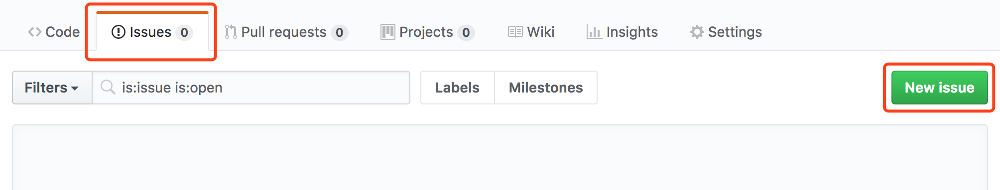
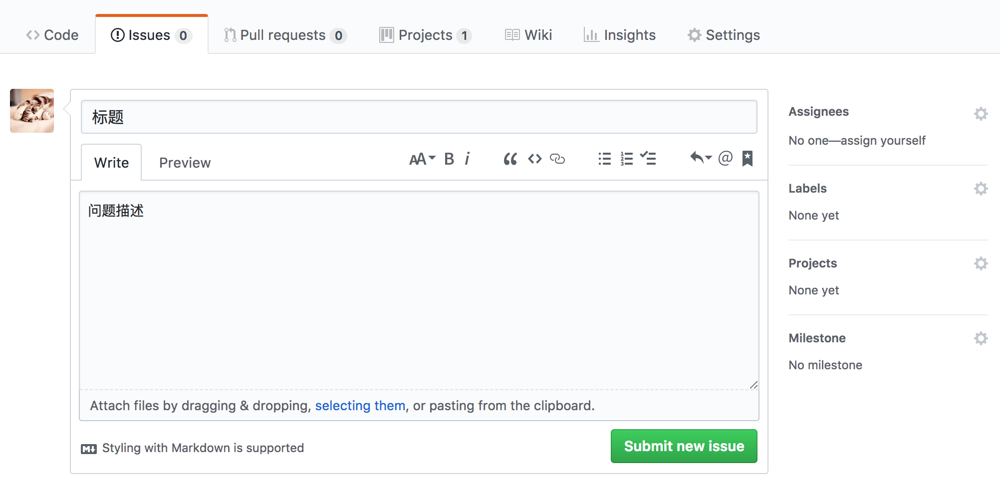

# 如何提供反馈（Issue）

### 创建Issue

打开仓库链接：https://github.com/udacity/fend-issues-zh/issues ，选择 `Issues` 面板新建 `issue` ：

问题描述完毕后点击 `Submit new issue` ，提交。

### 反馈模板

#### Issue 标题
请采用以下格式填写标题，方便我们更高效的分类和处理：
`[课程缩写] 问题描述`

例如：
`[FEND]课程内容 markdown 语法错误，导致符号没有显示正确`

#### 按照反馈模板填写反馈内容

