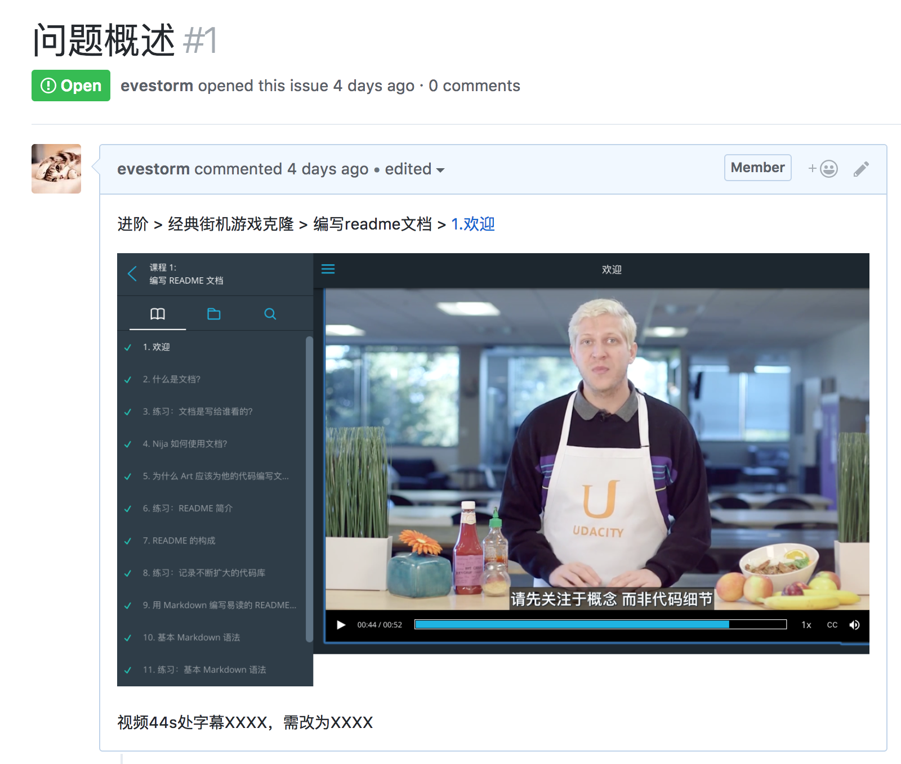

# 如何提供反馈（Issue）

### 创建Issue

打开仓库链接：https://github.com/udacity/cn-content-feedback/issues ，选择 `Issues` 面板新建 `issue` ：

问题描述完毕后点击 `Submit new issue` ，提交。

### 反馈模板

#### Issue 标题
请采用以下格式填写标题，方便我们更高效的分类和处理：
`[课程缩写] 问题描述`

例如：
`[FEND]课程内容 markdown 语法错误，导致符号没有显示正确`

#### 按照反馈模板填写反馈内容

 # Archival Note 
 This repository is deprecated; therefore, we are going to archive it. However, learners will be able to fork it to their personal Github account but cannot submit PRs to this repository. If you have any issues or suggestions to make, feel free to: 
- Utilize the https://knowledge.udacity.com/ forum to seek help on content-specific issues. 
- Submit a support ticket along with the link to your forked repository if (learners are) blocked for other reasons. Here are the links for the [retail consumers](https://udacity.zendesk.com/hc/en-us/requests/new) and [enterprise learners](https://udacityenterprise.zendesk.com/hc/en-us/requests/new?ticket_form_id=360000279131).